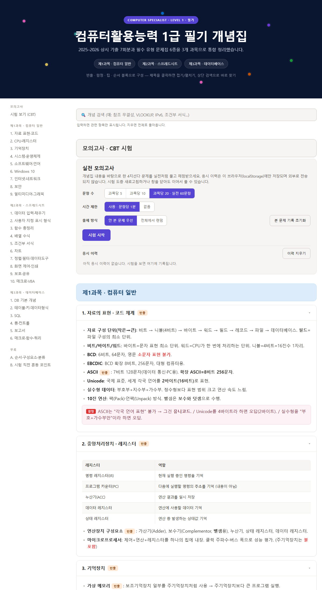
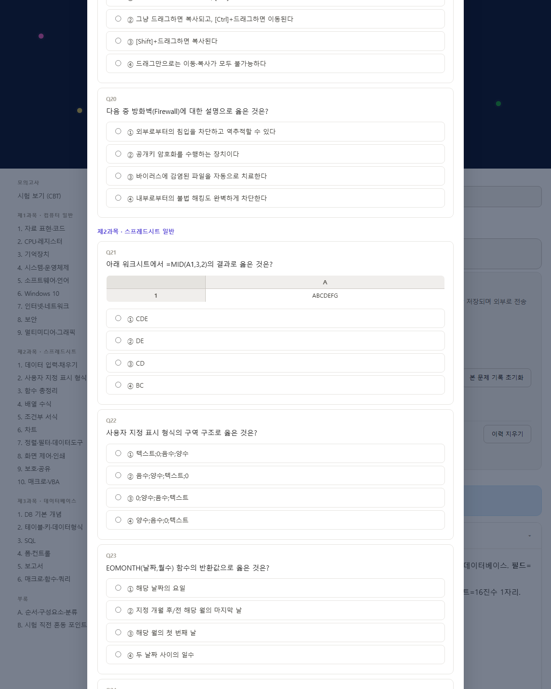
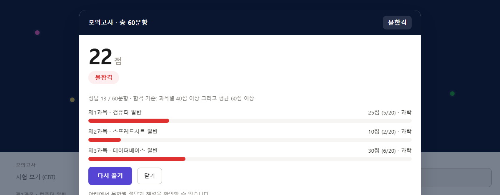

# 컴퓨터활용능력 1급 필기 — 개념집 + 모의고사(CBT)

컴활 1급 필기를 **개념 정리부터 실전 모의고사까지 한 번에** 끝내는 웹 학습 도구입니다.
설치·회원가입 없이 브라우저로 열면 되고, 파일 하나로 오프라인에서도 그대로 돌아갑니다.

> 🎁 **무료 맛보기(암호 없이 바로):** https://yuwolx.github.io/comact1-notes/demo/
> 🔒 **전체판 입장(구매 시 암호 제공):** https://yuwolx.github.io/comact1-notes/
>
> 맛보기에는 **제1과목 개념 + 샘플 12문항**(엑셀·DB 표 문제 포함)이 열려 있고,
> 전체판은 **3과목 개념 + 355문항** 모의고사입니다. 구매·문의: **yuwolxx@gmail.com**

---

## 미리보기

**과목별 개념집** — 3과목을 주제별 카드로 정리, 상단 검색·접기/펼치기

**실전 모의고사** — 엑셀 워크시트·DB 결과표가 나오는 표 문제까지

**자동 채점 · 합격 판정** — 과목별 점수와 과락 여부를 한눈에

---

## 담긴 것

### 개념집
- **3과목**(컴퓨터 일반 / 스프레드시트 / 데이터베이스)을 주제별 카드로 정리
- **빈출 · 함정(자주 틀리는 포인트) · 순서** 블록으로 핵심만 빠르게
- 상단 **검색**으로 개념 바로 찾기, 제목 클릭으로 접기/펼치기

### 모의고사(CBT) — 355문항
- 과목당 **5 · 10 · 20문항(실전 60)** 중 선택, **시간 제한** on/off
- **표 문제 지원** — 엑셀 셀(A·B·C / 1·2·3)과 DB 결과표를 화면에 직접 렌더링
  - 예) `=VLOOKUP`, `=INDEX/MATCH`, `=COUNTIF` 결과 / `COUNT(*)` vs `COUNT(필드)`, `GROUP BY~HAVING`, `INNER JOIN` 결과
- 풀 때마다 **문제·보기 순서 셔플**, **"안 본 문제 우선"** 출제로 반복 최소화
- **자동 채점 · 합격 판정**(과목별 40점 이상 + 평균 60점 이상) + 문항별 정답·해설
- **응시 이력**은 각자 브라우저(`localStorage`)에만 저장 — 외부 전송 없음
- **시험 도중 새로고침해도 이어풀기**

## 쓰는 법
1. 입장 링크를 열고 **암호 입력** → 개념집이 나타납니다.
2. 개념을 훑고 상단 **모의고사** 섹션에서 옵션을 골라 **시험 시작**.
3. 제출하면 점수·합격 여부와 해설이 뜨고, 응시 이력에 기록됩니다.

## 이용 안내 / 구매
- 입장 암호는 **구매하신 분께 제공**됩니다.
- 구매·문의: **yuwolxx@gmail.com**
- 암호는 기기·브라우저 종류와 무관하게 동일합니다.

## 참고
- 개인 학습용 정리본으로 **정확성을 보장하지 않습니다.** 실제 기준은 시행처(대한상공회의소) 안내를 확인하세요.
- 특정 교재·기관과 무관하며 제휴 관계가 없습니다.
- 문제·개념은 시험에 나오는 사실을 자체적으로 재서술한 것입니다.
